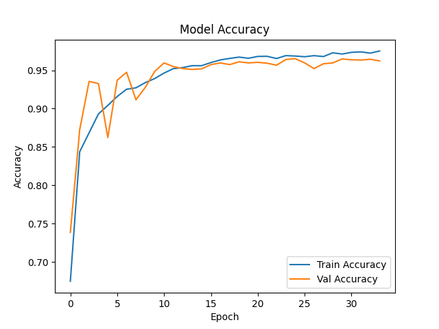
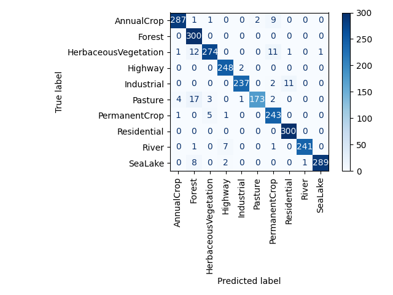
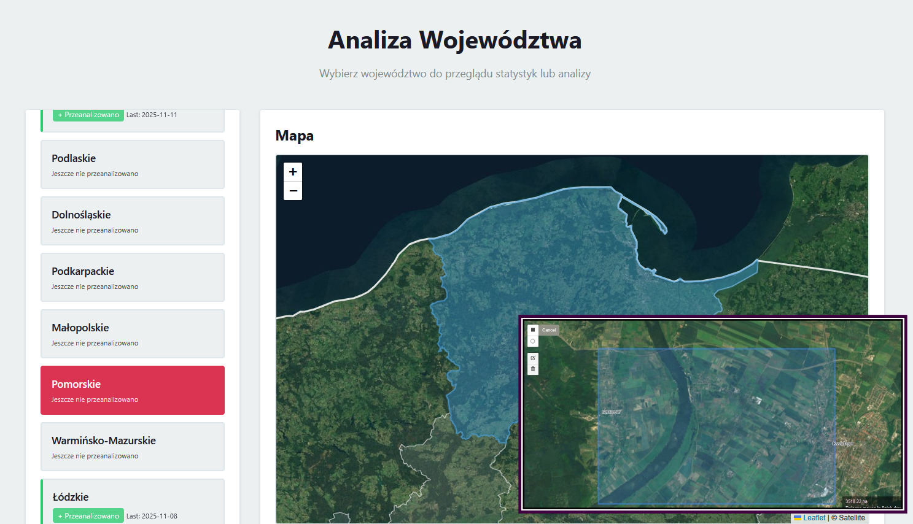
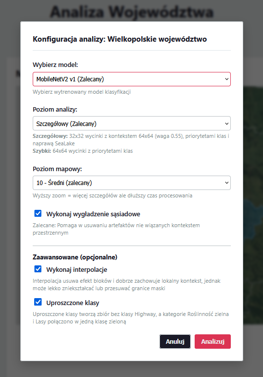
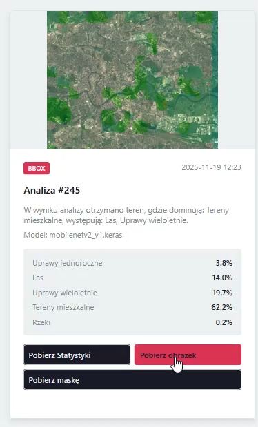
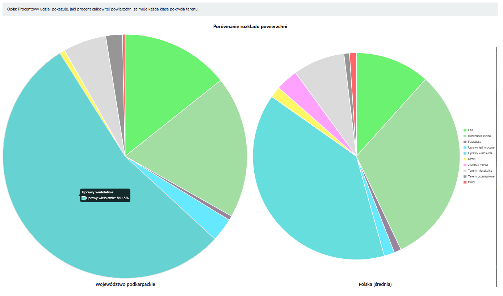
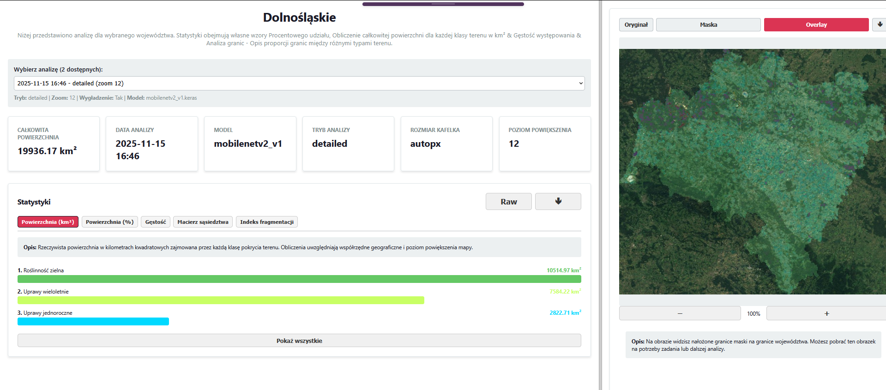

# LandCoverWebAoo release

## About
Application is aimed at analyzing various regions in Poland, specifically regarding land cover, 
utilizing data that have been processed by a neural network based on satellite imagery. 
Web app for analyzing selected areas on a map, including land cover statistics, overlay images, and visualizations.

## Features
- Select areas on a map and analyze land cover.
- Visualize results with overlay images and statistical charts.
- Export JSON stats.
## Model trained
A set of convolutional neural networks was used for general classification of satellite images.  
Selected neural networks (own CNN, Mobilenetv2) training, and evaluating individual models.

## LandcoverWebAppView

## Assets 
- `Classifier/inputs/networks/` – pre-trained neural networks
- `data/` – example image tiles / mbtiles
- `static`
  - `geodata`
  - `.js/` – frontend logic
  - `.css/` – styles
  - `.html` / Django templates – main UI

## Screenshots

### Map, UI

### Config & History with Analysis Panel

### Statistics Panel

### Analysis

